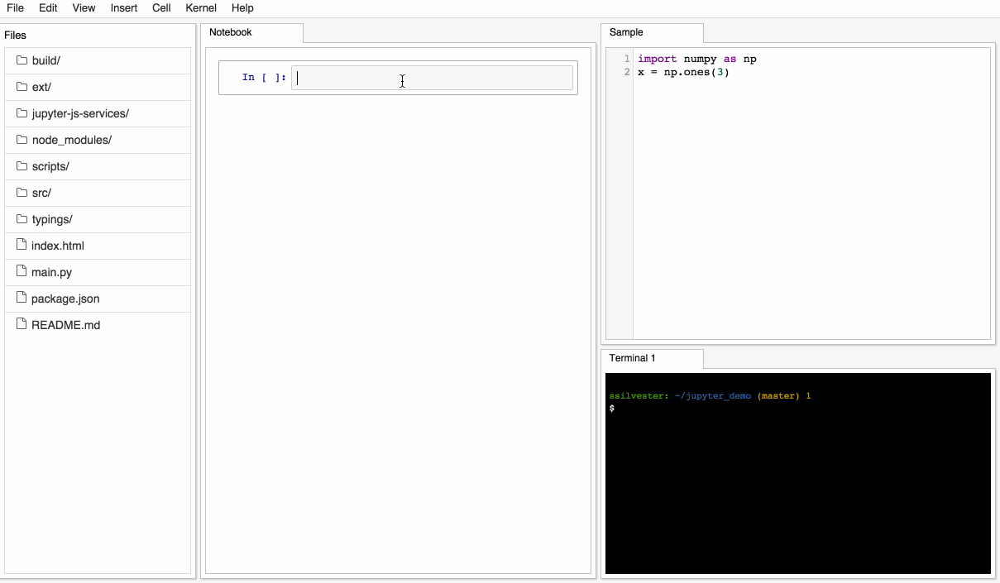

This is a proof on concept demonstration of integrating the refactoring work
on the Jupyter Notebook with Phosphor widgets.  It is not meant to be a fully
functional notebook.  Future development will occur in jupyter/notebook and 
related jupyter repositories.  Enjoy!


To install:

```
npm install 
npm run build
```

Requires the development version of Jupyter Notebook:

`pip install git+https://github.com/jupyter/notebook`

Link a dev version of jupyter-js-services that enable Google drive. 

```
$ cd path/to/jupyter-js-services`
jupyter-js-services $ npm link
link: /usr/local/node.... -> path/to/jupyter-js-services 
$ cd path/to/jupyter_demo
jupyter_demos $ npm link jupyter-js-services
link: ./node_modules/jupyter-js-services/ -> /usr/local/node.... -> path/to/jupyter-js-services

```


To run the demo:

`python main.py`

you will need to run `npm run build` in both `jupyter-js-services/` and this directory (in order) to make it work. 


Demo:

</img>
